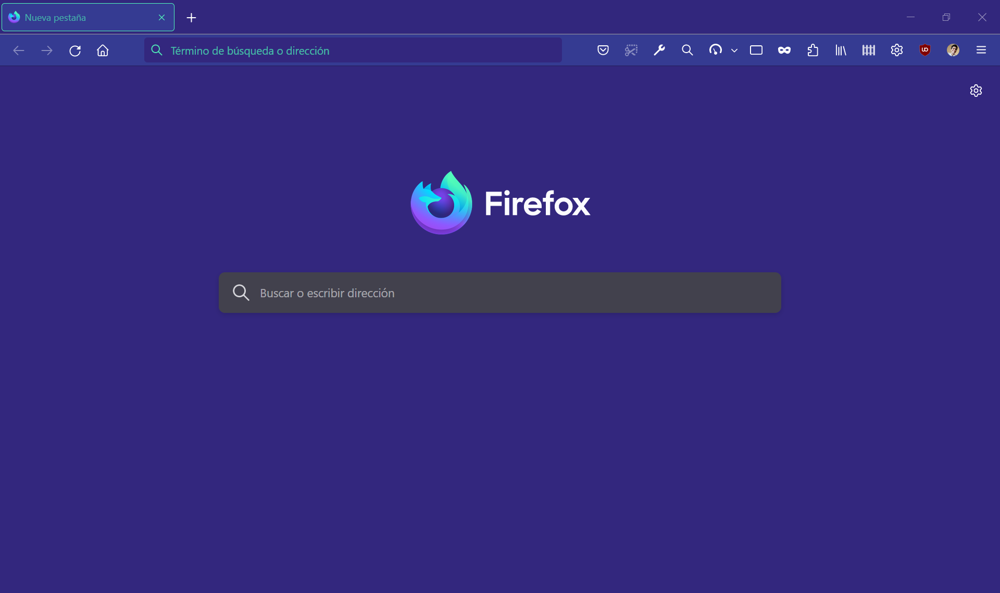

# Nightly Way To Surf The Web v2
A new, modern and futuristic theme, inspired in Firefox Nightly's design.

Did you enjoy my first theme? Try the new version, Nightly Way To Surf The Web v2 🎉 
If you have any suggestions, tell me in the comments! All the feedback is welcomed! 🦊🔥

This is what it looks like using:
Windows|GNU/Linux
---|---
|

## License

Copyright © 2023 Sergio Varela

Nightly Way To Surf The Web v2 is free software: you can redistribute it and/or modify it under the terms of the GNU General Public License as published by the Free Software Foundation, either version 3 of the License, or (at your option) any later version.

Nightly Way To Surf The Web v2 is distributed in the hope that it will be useful, but WITHOUT ANY WARRANTY; without even the implied warranty of MERCHANTABILITY or FITNESS FOR A PARTICULAR PURPOSE. See the GNU General Public License for more details.

You should have received a copy of the GNU General Public License. If not, see http://www.gnu.org/licenses/.
